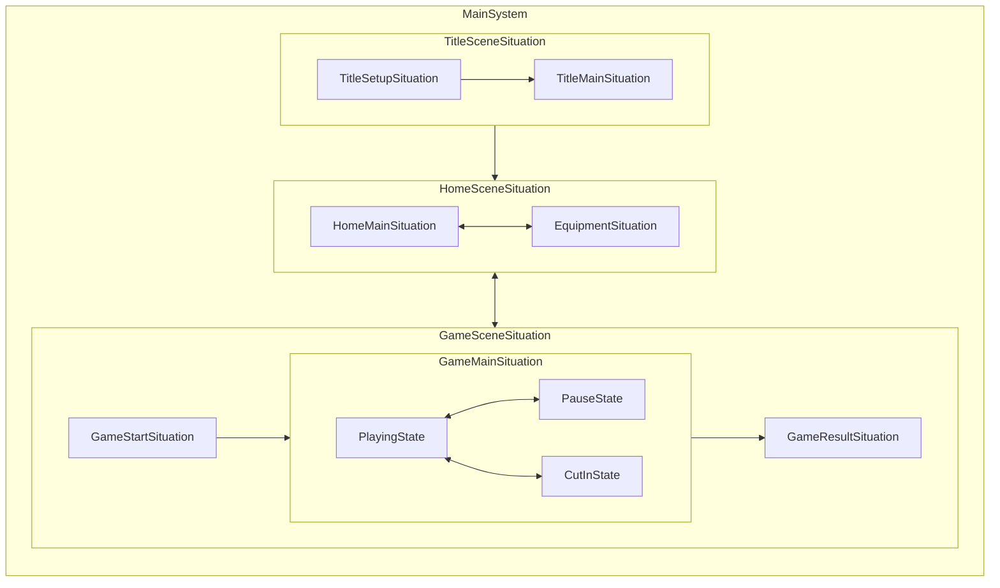

# game-framework
## 概要
Unityでゲーム制作する際のアーキテクチャ設計に関わるフレームワークです

基本的に、以下の要件を重要視した設計になっています
- 実行順の制御を容易にしたい
- 非同期処理を記述する箇所を明確にしたい
- 非同期処理や初期化処理の解放タイミングなどを明確かつシンプルにしたい
- レイヤーを作りすぎず、実装に対してのクラス量を抑えたい
- 仕様の変化になるべく強くしたい

## ライフサイクルについて
game-frameworkでは、「Unityにおけるシーン管理」だけでは不足しがちな、ライフサイクルの階層的管理をサポートしています

具体的には
- MainSystem
- Situation
- State

が該当します

### MainSystem
アプリ起動中のライフサイクルを管理するクラスで、Singleton的な動きをします

アプリケーションの以下のサイクルを管理できます
- アプリケーション起動時の初期化処理
- アプリケーションソフトリブート時のリセット処理
- アプリケーション起動中の更新処理
- アプリケーション終了時の処理

具体例で言うと、以下のような記述を書きます
- 初期シーンの決定（タイトル画面など）
- 常駐システムの生成/初期化やリセット処理

### Situation
Unityのシーンでは管理しづらい階層的なシーン管理（ここではシチュエーション管理）を行います

例えば以下のような階層設計が可能です
- TitleSceneSituation // title.unity
  - TitleSetupSituation // タイトルロゴ
  - TitleMainSituation // タイトルメニュー
- HomeSceneSituation // home.unity
  - HomeMainSituation // ホーム画面メイン
  - EquipmentSituation // 装備画面
- GameSceneSituation // game.unity
  - GameStartSituation // ゲーム開始演出
  - GameMainSituation // ゲームメイン
  - GameResultSituation // ゲーム結果

### State
Situationでは大きすぎるような簡易的な状態毎の定義を記述するために使用します

例えば以下のような状態で使用します
- GameMainSituation // 装備画面
  - State.Playing // プレイ中
  - State.Pause // 一時停止中
  - State.CutIn // カットイン再生中

### まとめ
- MainSystem
  - 必ず一つ
  - 常駐システムの初期化や更新を行う場所
- Situation
  - Unityシーンの切り替わり + その内部での大きな切り替わり
  - ロード、初期化、更新、解放などの非同期的な物を含むライフサイクルを管理する
- State
  - 必要に応じて使う（使わなくても可能）
  - 実質、解放処理付きswitchのような扱い
  - 同期的な初期化とState切り替わり時の終了処理の記述に特化している
  

## コアになっている機能について
### TaskRunner
UnityのUpdateに依存させずに更新順番の管理を行う場合に使用します

- UnityのUpdateを使わない理由
  - 各MonoBehaviour間の更新順の管理が曖昧になりやすい
  - 更新を呼びたいだけなのに、無駄にGameObjectやMonoBehaviourを作る必要がある
- Taskを使うポイント
  - 基本的に実行順番が重要になる物はこの更新サイクルに乗せるのが理想
    - UI, Camera, Transform, Effect など
- なぜ更新順が重要なのか
  - Action性の高いゲームの場合、Input > SetMotion > UpdateBone > ConstraintEffect/ConstarintUI のような1frameにおける処理順が重要になる
    - 上記がうまく出来てないと、3Dキャラに追従させたHPゲージなどがずれてしまったり、エフェクトや当たり判定の位置がずれてしまうなどが起きる

### CoroutineRunner
UnityのCoroutineやC#のasync等とは違い、更新タイミングにずれを無くしたい非同期処理に対して使うためのCoroutine実行用の機能です

- 専用で作る理由
  - 実行タイミングが読みづらい（次のフレームになってしまう、他の連携すべき処理順とずれたタイミングで実行されてしまうなど）
    - これに起因して、1フレーム待つコードなどが増えてしまう事を防止する
  - 本来の非同期処理とは違う意図のコード（WaitForEndOfFrameなど)が使われてしまう

### IScope
C#のCancellationTokenやUniRx等のCompositeDisposableなどの非同期処理のキャンセルや購読解除のタイミングを共通化するためのInterfaceです

- 専用で作る理由
  - ライフサイクル用のシステム（Situation, Stateなど)で共通的に初期化と対となる解放処理を定義しやすくする目的
  - 既存の物だと、拡張メソッドでは回避しづらくなるケースもあるが、IScopeは拡張メソッドでUniRxでのTakeUntil, AddToを拡張したり、CancellationTokenへの変換なども対応しやすいため

### ServiceContainer
### LayeredTime

